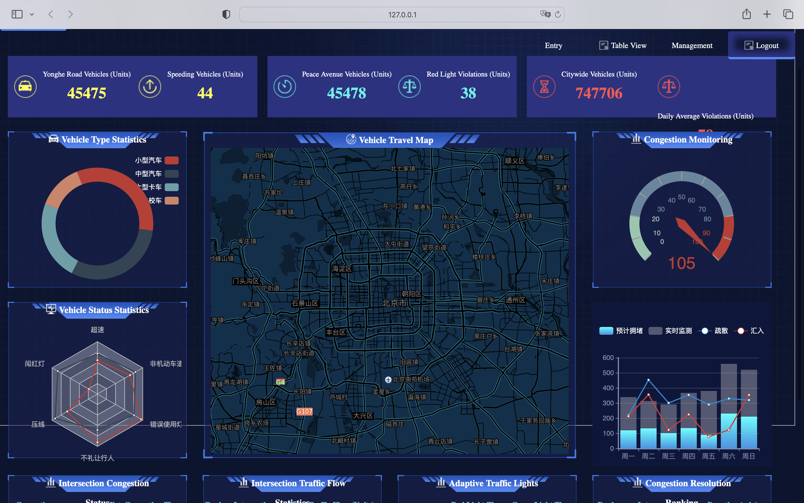
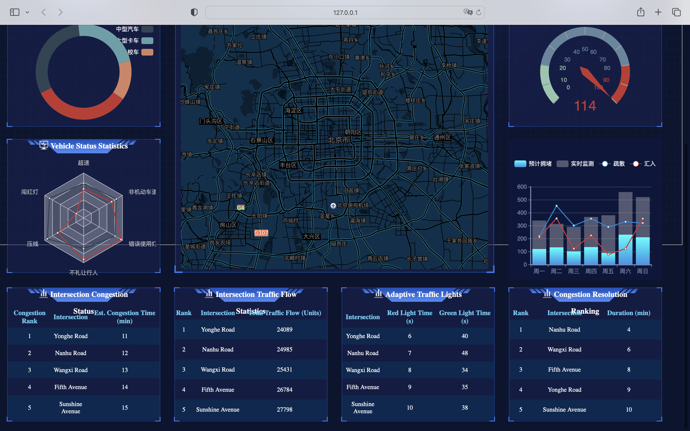

# Smart-Transportation-Big-Data-Monitoring-Platform

## How to start
Run the following command to install the dependency    
   pip install -r requirements.txt   
Run the file 'admin.py' to start the project  
Click the link below to open the website:  
   http://127.0.0.1:5000/

## ACCOUNTS
user：admin  password: 123456  
admin：admins   password: admins

## INTRODUCTION
From a functional architecture perspective, the Traffic Big Data Monitoring System comprises three core modules: a real-time data monitoring dashboard, map visualization, and vehicle analysis and statistics.

### **Real-Time Data Monitoring Dashboard**
The dashboard displays key metrics in real time, such as the number of vehicles on Yonghe Road, overspeeding vehicles, and vehicles on Heping Avenue. Additionally, it aggregates data on traffic violations, including vehicles running red lights, daily average violations, and macro-level statistics such as the total number of vehicles in the city.

### **Map Visualization**
The map visualization module supports fundamental map operations while offering advanced features such as marking key monitoring locations with red dots and enabling layer switching for personnel, vehicles, buildings, and surveillance cameras. It integrates search and comparison functionalities and presents rankings for congested tourist spots to provide early warnings.

### **Vehicle Analysis and Statistics**
The system records detailed data on vehicle types, including small cars, medium-sized cars, large vehicles, and non-motorized vehicles. Proportions of each vehicle type are visualized through pie charts. Furthermore, horizontal bar charts display statistics on various states of vehicles—such as driving, parking, idling, and overspeeding—across different categories.

### **Monitoring Indicators System**
The system continuously monitors congestion indices, tracks traffic violations such as overspeeding and running red lights, analyzes traffic flow trends, and issues warnings for key areas with potential traffic issues.

### **System Features and Navigation**
The platform provides navigation to modules such as data overview, map interface, query and statistics, tabular interface, and backend management. It supports basic operations like data entry and user login/logout.

### **Key Characteristics**
Key features include real-time monitoring, multi-dimensional analysis, intelligent warnings, user-friendly operations, and comprehensive data coverage across vehicles, personnel, and facilities.

### **Value Proposition**
As a comprehensive traffic monitoring platform, this system offers decision-making support for traffic management departments, assists in optimizing traffic strategies, enhances the efficiency of detecting traffic violations, and facilitates intelligent analysis and visualization of traffic data. It is a vital tool for improving urban traffic management and elevating overall traffic governance levels.

## OUTCOME
   

